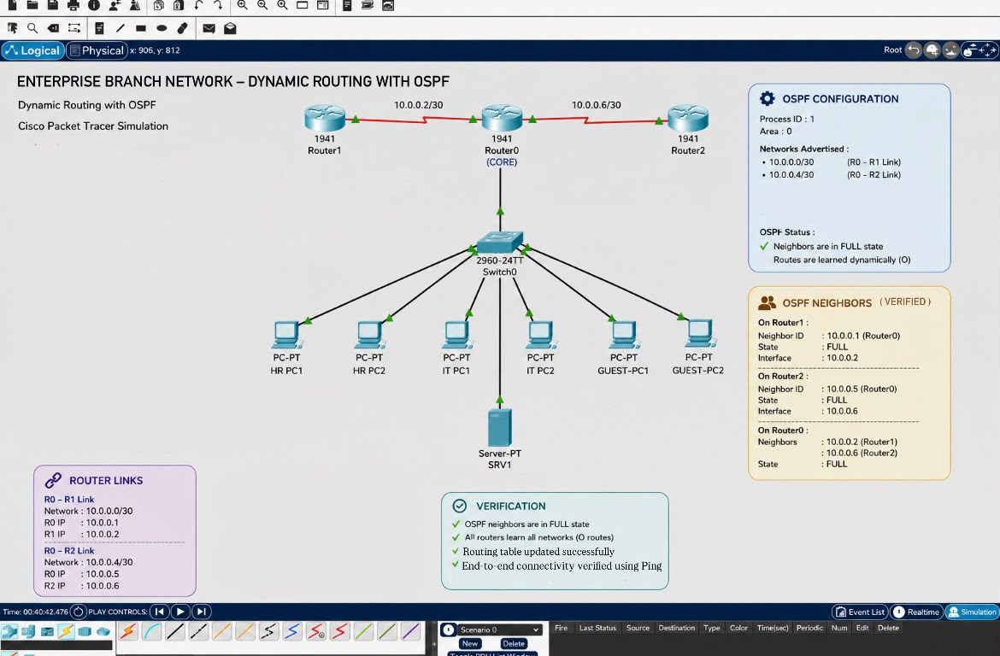

# Enterprise Branch Network with OSPF Dynamic Routing

Implementation of OSPF dynamic routing in an enterprise branch network using Cisco Packet Tracer.

---

## Overview

This project demonstrates the implementation of OSPF (Open Shortest Path First) dynamic routing in an enterprise branch network using Cisco Packet Tracer.

The topology consists of three Cisco routers connected through serial links. OSPF Area 0 is configured to dynamically exchange routing information, allowing all routers to automatically learn remote networks and provide end-to-end connectivity.

---

## Technologies Used

- Cisco Packet Tracer
- Cisco IOS CLI
- OSPF (Open Shortest Path First)
- Dynamic Routing
- VLANs
- DHCP

---

## Network Topology

- 3 Cisco 1941 Routers
- 1 Cisco 2960 Switch
- HR VLAN
- IT VLAN
- Guest VLAN
- DHCP Server
- Multiple End Devices

---

## OSPF Configuration

- OSPF Process ID: 1
- Area: 0
- Dynamic route advertisement
- Neighbor adjacency established successfully
- Routing tables updated automatically

---

## Features

- Dynamic routing using OSPF
- Automatic route learning
- OSPF neighbor adjacency (FULL state)
- End-to-end connectivity verification
- Multi-router enterprise topology
- DHCP-enabled clients

---

## Verification

- OSPF neighbors reached the FULL state
- Routing tables contain dynamically learned OSPF routes
- Successful ping between connected networks
- End-to-end connectivity verified using Ping

---

## Skills Demonstrated

- OSPF Dynamic Routing
- Cisco IOS CLI
- Network Troubleshooting
- Route Verification
- Enterprise Network Design
- Cisco Packet Tracer

---

## Files

- `Enterprise-Branch-Network-OSPF.pkt`
- `Dynamic-Routing-with-OSPF.jpeg`
- `README.md`

---

## Author

**Rawan Alqahtani**
